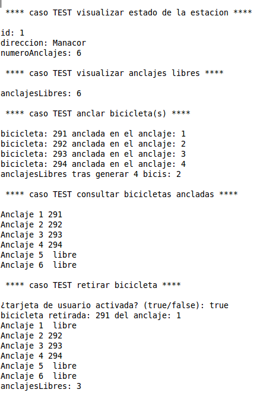

# Bicipalma Exam

IMPORTANT! All the starting information was provided by my teacher before doing the exam. (UML, userstories, etc.).

A repository to solve the problem of the year 2014 to train static arrays in Java and getting familiar with this new language.

This is created to solve it with TDD: using the test cases, the UML diagram and the main app that the teacher gave us.

The [link](https://github.com/dfleta/bicipalma) to the solution of my teacher.

I did not follow the diagram to code it all since i just tried to solve it using TDD and making it the simplest posible.

## Users Story

While i was writing code i tried to solve the [test cases](./bicipalma/src/test/java/edu/craptocraft/bicipalma/domain/estacion/EstacionTest.java) and the following "users story"/"uses cases":

## UML

